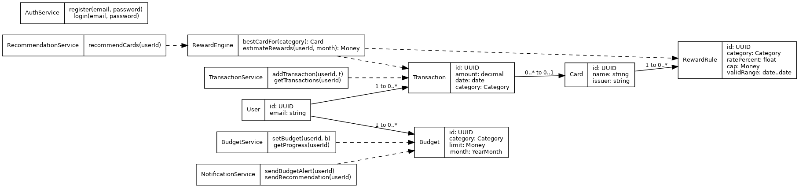

# CardSense
*CS180 Group Project*

**Manage user's budgets and maximize credit card rewards by tracking spending**


**Authors**

[](https://github.com/XiyuanWu)
[](https://github.com/androodo)
[]()
[]()


## Introduction

Many Americans face numerous financial challenges under certain circumstances, particularly during the pandemic. A large group of cardholders can’t pay their credit card bill in one, resulting in them paying high interest fees. On the other hand, many cardholders may or may not be able to pay their bill in one, but those who use only a single or a very few number of cards miss out on potential rewards that would have been earned by using more suitable cards for specific categories, such as groceries, gas, and dining. Our web app addresses both problems separately and together: a budget tracker to reduce interest costs, and a card-rewards optimizer to help users earn more on ordinary spending.

## User Interface Specification

### User Diagram

<!-- Place diagram to `img/` folder -->

[User Diagram]


### Class Diagram Draft



## Project Structure

```py
CardSense/
│
├─ api/                   # Django PROJECT (global config/container)
│
├─ accounts/              # Django APP: authentication & user management
├─ transactions/          # Django APP: user transactions (manual/CSV), CRUD, signals
├─ budgets/               # Django APP: single monthly budget per user + alert thresholds/events
├─ cards/                 # Django APP: card products and reward rules
├─ optimizer/             # Django APP: best-card recommendation engine (service endpoints)
│
├─ web/                   # React web app (the UI)
│
├─ venv/                  # Python virtual environment (local only; not shared)
├─ db.sqlite3             # Dev database (local)
├─ manage.py              # Django CLI helper (runserver, migrate, etc.)
└─ README.md              # Project overview & quickstart
```


## Screenshots

Here is our program look like:

[Insert Picture]


## Installation/Usage

**Prerequisites**
- Python 3.x
- Node.js and npm
- Git

**Clone the Repository**
```bash
git clone https://github.com/btaquee/CardSense.git
```

**Install dependencies**

Django

*Note that Django need run under virtual environment!*

```py
# Create virtual environment
python -m venv venv

# Activate it
.\venv\Scripts\Activate.ps1      # Windows
source venv/bin/activate         # macOS/Linux

# Install Django 
pip install Django
```
React

```py
# Switch to `web` folder
cd web

# Install React dependencies
npm install
```

**Running the Website**

```bush
npm start
```
Website should live on http://localhost:3000/

<!-- 
You need **TWO terminal windows** running simultaneously:

#### Terminal 1 - Django Backend
```bash
# Navigate to project root (CardSense folder)
cd CardSense

# Activate virtual environment
# Windows:
.\venv\Scripts\Activate.ps1
# macOS/Linux:
# source venv/bin/activate

# Start Django server
python manage.py runserver
```
✅ Backend runs at: **http://127.0.0.1:8000/**

#### Terminal 2 - React Frontend
```bash
# Navigate to web folder
cd CardSense/web

# Start React dev server
npm start
```
✅ Frontend runs at: **http://localhost:3000/**

### Testing the Setup

1. **Backend Health Check**: Visit http://127.0.0.1:8000/api/accounts/health/
   - Should return: `{"status":"ok"}`

2. **Frontend**: Visit http://localhost:3000
   - Should display the React application

### Stopping the Servers
Press `CTRL+C` in each terminal window to stop the servers.

### Important Notes
⚠️ **Common Mistake**: Make sure you run commands from the correct directory:
- Django commands: Run from `CardSense/` (project root)
- React commands: Run from `CardSense/web/` (web folder)

⚠️ **Virtual Environment**: Always activate the virtual environment before running Django commands. 
-->


<!-- ## Testing

I don't think user need this part. Don't show live to user

Run backend tests:
```bash
# From CardSense/ directory with venv activated
python manage.py test
```

Run frontend tests:
```bash
# From CardSense/web/ directory
npm test 
```
-->