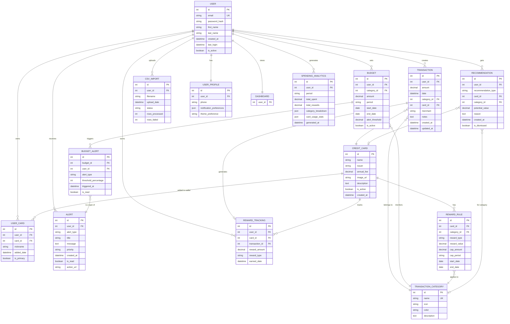

# CardSense Entity Relationship Diagram

## Database ER Diagram



## Relationship Descriptions

### One-to-Many Relationships

| Parent | Child | Cardinality | Description |
|--------|-------|-------------|-------------|
| USER | TRANSACTION | 1:N | A user can have many transactions |
| USER | BUDGET | 1:N | A user can set multiple budgets |
| USER | USER_CARD | 1:N | A user can own multiple credit cards |
| USER | ALERT | 1:N | A user can receive many alerts |
| USER | RECOMMENDATION | 1:N | A user gets personalized recommendations |
| USER | CSV_IMPORT | 1:N | A user can upload multiple CSV files |
| USER | REWARD_TRACKING | 1:N | A user earns rewards over time |
| USER | SPENDING_ANALYTICS | 1:N | A user has multiple analytics reports |
| TRANSACTION_CATEGORY | TRANSACTION | 1:N | A category has many transactions |
| TRANSACTION_CATEGORY | BUDGET | 1:N | A category can have multiple budgets (different periods) |
| TRANSACTION_CATEGORY | REWARD_RULE | 1:N | A category can have multiple reward rules (different cards) |
| CREDIT_CARD | USER_CARD | 1:N | A card can be in many user's wallets |
| CREDIT_CARD | REWARD_RULE | 1:N | A card has multiple reward rules (per category) |
| CREDIT_CARD | REWARD_TRACKING | 1:N | A card generates many reward entries |
| BUDGET | BUDGET_ALERT | 1:N | A budget can trigger multiple alerts |

### One-to-One Relationships

| Entity A | Entity B | Description |
|----------|----------|-------------|
| USER | USER_PROFILE | Each user has one profile |
| USER | DASHBOARD | Each user has one dashboard view |
| TRANSACTION | REWARD_TRACKING | Each transaction generates one reward entry |

### Many-to-One Relationships

| Child | Parent | Description |
|-------|--------|-------------|
| TRANSACTION | USER | Many transactions belong to one user |
| TRANSACTION | TRANSACTION_CATEGORY | Many transactions in one category |
| TRANSACTION | CREDIT_CARD | Many transactions on one card |
| USER_CARD | USER | Many cards belong to one user |
| USER_CARD | CREDIT_CARD | Many users can have the same card |

### Optional Relationships (0..1 or 0..N)

| Entity A | Entity B | Cardinality | Note |
|----------|----------|-------------|------|
| TRANSACTION | CREDIT_CARD | N:1 (optional) | Cash transactions don't have a card |
| RECOMMENDATION | CREDIT_CARD | N:0..1 | Some recommendations aren't card-specific |
| RECOMMENDATION | TRANSACTION_CATEGORY | N:0..1 | Some recommendations aren't category-specific |

## Key Constraints

### Primary Keys (PK)
- Every table has an auto-incrementing integer `id` as primary key
- Ensures unique identification of each record

### Foreign Keys (FK)
- Enforces referential integrity
- Prevents orphaned records
- Cascading deletes where appropriate

### Unique Keys (UK)
- `USER.email` - No duplicate email addresses
- `TRANSACTION_CATEGORY.name` - Unique category names

### Not Null Constraints
- `USER.email`, `USER.password_hash` - Required for authentication
- `TRANSACTION.amount`, `TRANSACTION.date` - Required for tracking
- `BUDGET.amount`, `BUDGET.category_id` - Required for budgeting
- `CREDIT_CARD.name` - Required for identification
- `REWARD_RULE.card_id`, `REWARD_RULE.category_id` - Required for matching

### Check Constraints
```sql
CHECK (TRANSACTION.amount >= 0)
CHECK (BUDGET.amount > 0)
CHECK (BUDGET.alert_threshold BETWEEN 0 AND 100)
CHECK (REWARD_RULE.reward_value >= 0)
CHECK (CREDIT_CARD.annual_fee >= 0)
```

### Default Values
- `USER.is_active` = TRUE
- `USER.created_at` = CURRENT_TIMESTAMP
- `TRANSACTION.created_at` = CURRENT_TIMESTAMP
- `BUDGET.period` = 'monthly'
- `BUDGET.alert_threshold` = 80.00
- `BUDGET.is_active` = TRUE
- `CREDIT_CARD.annual_fee` = 0
- `CREDIT_CARD.is_active` = TRUE

## Indexes for Performance

### High-Priority Indexes
```sql
-- User lookups
CREATE INDEX idx_user_email ON USER(email);

-- Transaction queries
CREATE INDEX idx_transaction_user_date ON TRANSACTION(user_id, date);
CREATE INDEX idx_transaction_category ON TRANSACTION(category_id);
CREATE INDEX idx_transaction_card ON TRANSACTION(card_id);

-- Budget queries
CREATE INDEX idx_budget_user_active ON BUDGET(user_id, is_active);
CREATE INDEX idx_budget_category ON BUDGET(category_id);

-- Card queries
CREATE INDEX idx_user_card_user ON USER_CARD(user_id);
CREATE INDEX idx_user_card_card ON USER_CARD(card_id);

-- Reward queries
CREATE INDEX idx_reward_rule_card_category ON REWARD_RULE(card_id, category_id);
CREATE INDEX idx_reward_tracking_user ON REWARD_TRACKING(user_id);

-- Alert queries
CREATE INDEX idx_alert_user_read ON ALERT(user_id, is_read);
CREATE INDEX idx_budget_alert_budget ON BUDGET_ALERT(budget_id);
```

## Data Integrity Rules

### Business Logic Constraints

1. **Budget Periods**
   - `start_date` must be before `end_date`
   - Periods should not overlap for same user/category

2. **Reward Rules**
   - `start_date` must be before `end_date` if both exist
   - `cap_amount` only valid if `cap_period` is set

3. **Transactions**
   - `date` should not be in the future
   - `amount` must be positive

4. **User Cards**
   - Only one card can be marked as `is_primary` per user

5. **Alerts**
   - `triggered_at` cannot be before budget `created_at`

### Cascading Rules

```sql
-- When user is deleted, delete all related data
ON DELETE CASCADE:
- USER → TRANSACTION
- USER → BUDGET
- USER → USER_CARD
- USER → ALERT
- USER → RECOMMENDATION

-- When card is deleted, keep historical data
ON DELETE SET NULL:
- CREDIT_CARD → TRANSACTION.card_id

-- When category is deleted, prevent if in use
ON DELETE RESTRICT:
- TRANSACTION_CATEGORY (if transactions exist)
```

## Sample Queries

### Get User's Monthly Spending by Category
```sql
SELECT 
    tc.name AS category,
    SUM(t.amount) AS total_spent,
    b.amount AS budget_limit,
    (SUM(t.amount) / b.amount * 100) AS percentage_used
FROM TRANSACTION t
JOIN TRANSACTION_CATEGORY tc ON t.category_id = tc.id
LEFT JOIN BUDGET b ON b.category_id = tc.id 
    AND b.user_id = t.user_id 
    AND b.is_active = TRUE
WHERE t.user_id = ? 
    AND t.date >= ?
    AND t.date < ?
GROUP BY tc.id, tc.name, b.amount;
```

### Find Best Card for Category
```sql
SELECT 
    cc.name AS card_name,
    rr.reward_value,
    rr.reward_type,
    rr.cap_amount
FROM CREDIT_CARD cc
JOIN REWARD_RULE rr ON cc.id = rr.card_id
JOIN USER_CARD uc ON cc.id = uc.card_id
WHERE uc.user_id = ?
    AND rr.category_id = ?
    AND cc.is_active = TRUE
    AND (rr.start_date IS NULL OR rr.start_date <= CURRENT_DATE)
    AND (rr.end_date IS NULL OR rr.end_date >= CURRENT_DATE)
ORDER BY rr.reward_value DESC
LIMIT 1;
```

### Get Budget Alerts Due
```sql
SELECT 
    b.id AS budget_id,
    tc.name AS category,
    SUM(t.amount) AS spent,
    b.amount AS limit,
    (SUM(t.amount) / b.amount * 100) AS percentage
FROM BUDGET b
JOIN TRANSACTION_CATEGORY tc ON b.category_id = tc.id
LEFT JOIN TRANSACTION t ON t.category_id = b.category_id
    AND t.user_id = b.user_id
    AND t.date BETWEEN b.start_date AND b.end_date
WHERE b.user_id = ?
    AND b.is_active = TRUE
    AND CURRENT_DATE BETWEEN b.start_date AND b.end_date
GROUP BY b.id, tc.name, b.amount
HAVING (SUM(t.amount) / b.amount * 100) >= b.alert_threshold;
```

## Normalization Level

The database schema follows **Third Normal Form (3NF)**:

✅ **1NF**: All attributes contain atomic values  
✅ **2NF**: No partial dependencies on composite keys  
✅ **3NF**: No transitive dependencies

### Benefits:
- Minimal data redundancy
- Data integrity maintained
- Easy to update and maintain
- Flexible for future changes

### Trade-offs:
- May require more JOINs for complex queries
- Denormalization may be needed later for specific analytics queries

