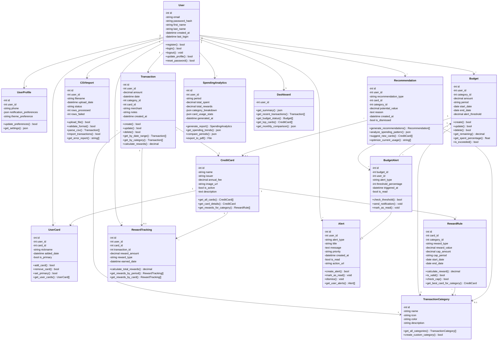

# CardSense Class Diagram (Mermaid)

## Key Classes Description

### User Management
- **User**: Core user entity with authentication methods
- **UserProfile**: Extended user settings and preferences

### Transaction Management
- **Transaction**: Individual spending records
- **TransactionCategory**: Categorization system (groceries, gas, dining, etc.)
- **CSVImport**: Handles bulk transaction imports

### Budget Management
- **Budget**: Category-based spending limits
- **BudgetAlert**: Automated notifications for budget thresholds

### Credit Card Management
- **CreditCard**: Database of available credit cards
- **UserCard**: User's personal credit card wallet
- **RewardRule**: Card-specific reward rates and rules
- **RewardTracking**: Historical record of earned rewards

### Intelligence Layer
- **Recommendation**: Personalized card and spending suggestions
- **Alert**: Notification system for various events
- **SpendingAnalytics**: Statistical analysis and reporting
- **Dashboard**: Aggregated view of user data

