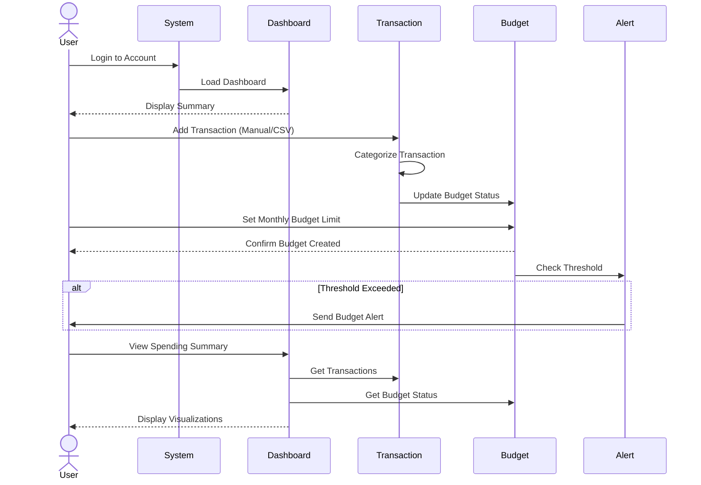
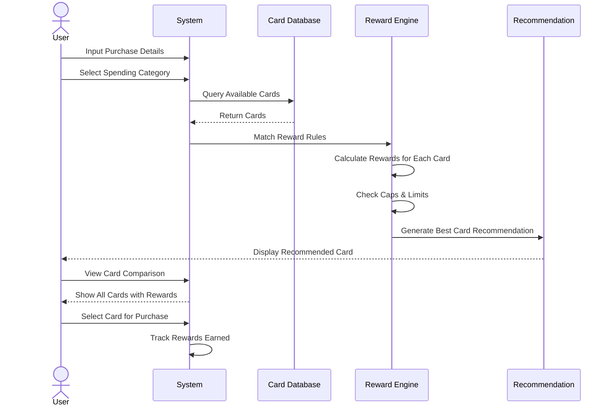
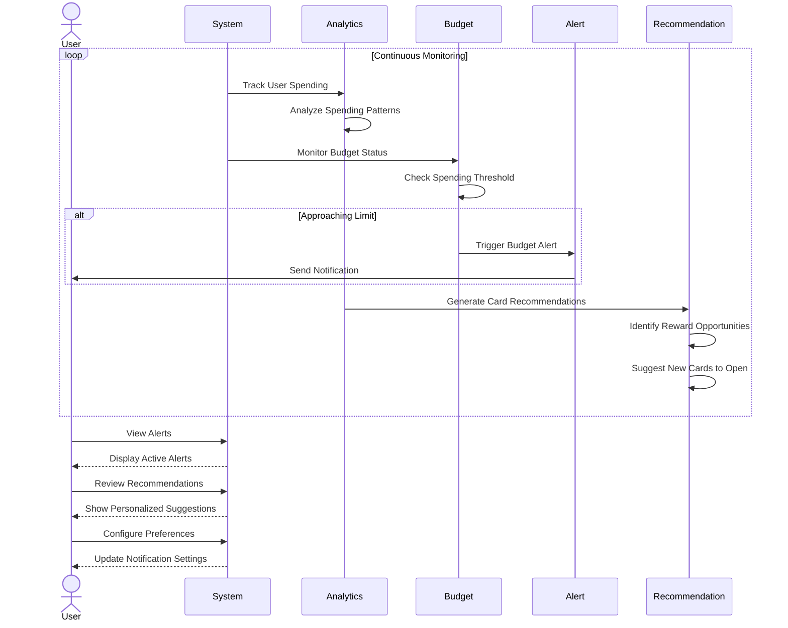

# CardSense Use Case Diagram

## Main Use Case Diagram

```mermaid
graph TB
    User((User))
    Guest((Guest))
    System((System))
    
    subgraph "Authentication"
        UC1[Register Account]
        UC2[Login]
        UC3[Logout]
        UC4[Reset Password]
        UC5[Update Profile]
    end
    
    subgraph "Transaction Management"
        UC6[Add Transaction Manually]
        UC7[Upload CSV File]
        UC8[Edit Transaction]
        UC9[Delete Transaction]
        UC10[View Transaction History]
        UC11[Filter Transactions]
    end
    
    subgraph "Budget Management"
        UC14[Create Budget]
        UC15[Set Budget Limits]
        UC16[View Budget Status]
        UC17[Edit Budget]
        UC18[Delete Budget]
        UC19[View Spending by Category]
        UC20[Check Budget Remaining]
    end
    
    subgraph "Credit Card Management"
        UC21[Browse Card Database]
        UC22[Add Card to Wallet]
        UC23[Remove Card from Wallet]
        UC24[View Card Details]
        UC25[View Card Rewards]
        UC26[Set Primary Card]
    end
    
    subgraph "Reward Optimization"
        UC27[Get Best Card Recommendation]
        UC28[Calculate Potential Rewards]
        UC29[View Rewards Earned]
        UC30[Compare Cards for Purchase]
        UC31[Optimize Card Usage]
    end
    
    subgraph "Alerts & Notifications"
        UC32[Receive Budget Alerts]
        UC33[Configure Alert Thresholds]
        UC34[View Notifications]
        UC35[Dismiss Alerts]
        UC36[Set Notification Preferences]
    end
    
    subgraph "Personalized Recommendations"
        UC37[Get Spending Insights]
        UC38[Receive Card Suggestions]
        UC39[View Optimization Tips]
        UC40[Analyze Spending Patterns]
    end
    
    subgraph "Dashboard & Analytics"
        UC41[View Dashboard]
        UC42[View Spending Graphs]
        UC43[Generate Reports]
        UC44[Export Data]
        UC45[Compare Time Periods]
    end
    
    %% Guest connections
    Guest --> UC1
    
    %% User connections
    User --> UC2
    User --> UC3
    User --> UC4
    User --> UC5
    User --> UC6
    User --> UC7
    User --> UC10
    User --> UC14
    User --> UC16
    User --> UC21
    User --> UC22
    User --> UC27
    User --> UC29
    User --> UC32
    User --> UC34
    User --> UC37
    User --> UC38
    User --> UC41
    User --> UC43
    
    %% System connections
    System -.-> UC28
    System -.-> UC32
    System -.-> UC40
```

## Scenario 1: Tracking Spending and Budgets

## Scenario 2: Optimizing Credit Card Rewards

## Scenario 3: Personalized Recommendations and Alerts

## Detailed Use Cases

### UC6: Add Transaction Manually

**Primary Actor:** User

**Preconditions:**
- User is logged in
- User has access to the transaction management interface

**Main Flow:**
1. User navigates to "Add Transaction"
2. System displays transaction form
3. User enters transaction details:
   - Amount
   - Date
   - Category (dropdown)
   - Payment method/Card
   - Merchant name
   - Notes (optional)
4. System validates input
5. System categorizes transaction
6. System updates budget status
7. System displays success message

**Postconditions:**
- Transaction is saved to database
- Budget calculations are updated
- Dashboard reflects new transaction

---

### UC7: Upload CSV File

**Primary Actor:** User

**Preconditions:**
- User is logged in
- User has a properly formatted CSV file

**Main Flow:**
1. User selects "Upload CSV"
2. System displays file upload interface
3. User selects CSV file
4. System validates file format
5. System parses CSV data
6. System displays preview with categorizations
7. User confirms import
8. System imports transactions
9. System displays import summary

**Alternative Flows:**
- **4a.** Invalid format detected
  - System displays error message with format requirements
  - User can download sample template
- **8a.** Some rows fail validation
  - System imports valid rows
  - System displays error report for failed rows

**Postconditions:**
- Valid transactions are imported
- Budget statuses are updated
- Error report is generated if applicable

---

### UC27: Get Best Card Recommendation

**Primary Actor:** User

**Preconditions:**
- User is logged in
- User has cards in their wallet
- Card database is populated with reward rules

**Main Flow:**
1. User inputs purchase details (amount, category)
2. System queries card database
3. System retrieves reward rules for category
4. System calculates potential rewards for each card
5. System checks reward caps and limits
6. System ranks cards by reward value
7. System displays top recommendation with reasoning
8. User views detailed comparison

**Postconditions:**
- User knows which card offers best rewards
- Recommendation is logged for analytics

---

### UC32: Receive Budget Alerts

**Primary Actor:** System (triggered), User (receives)

**Preconditions:**
- User has set budget limits
- User has configured alert thresholds

**Main Flow:**
1. System monitors spending continuously
2. System calculates percentage of budget used
3. System checks if threshold is reached (e.g., 80%, 90%, 100%)
4. System triggers alert
5. System sends notification to user
6. User receives and views alert
7. User can take action or dismiss

**Alert Types:**
- Warning (80% threshold)
- Critical (90% threshold)
- Exceeded (100% threshold)

**Postconditions:**
- Alert is logged
- User is notified
- Alert appears in notification center

---

### UC38: Receive Card Suggestions

**Primary Actor:** System (generates), User (receives)

**Preconditions:**
- User has transaction history
- System has analyzed spending patterns

**Main Flow:**
1. System analyzes user's spending patterns
2. System identifies high-spend categories
3. System queries card database for better options
4. System calculates potential additional rewards
5. System generates personalized recommendations
6. System presents suggestions to user with:
   - Recommended card details
   - Potential value/savings
   - Reasoning based on spending history
7. User reviews recommendations
8. User can save or dismiss suggestions

**Postconditions:**
- Recommendations are displayed
- User can act on suggestions
- Interactions are tracked for future improvements

---

## Actor Descriptions

### User
- Registered account holder
- Can perform all authenticated actions
- Primary beneficiary of the system

### Guest
- Unauthenticated visitor
- Can only register for an account
- Limited access to features

### System
- Automated background processes
- Performs calculations and analysis
- Generates recommendations and alerts
- Monitors budgets and thresholds

## Summary of Features

| Category | Use Cases Count | Description |
|----------|----------------|-------------|
| Authentication | 5 | User account management |
| Transaction Management | 8 | Add, edit, view, import transactions |
| Budget Management | 7 | Create and monitor budgets |
| Credit Card Management | 6 | Manage personal card wallet |
| Reward Optimization | 5 | Maximize credit card rewards |
| Alerts & Notifications | 5 | Proactive user notifications |
| Recommendations | 4 | AI-driven spending insights |
| Dashboard & Analytics | 5 | Data visualization and reporting |

**Total Use Cases:** 45

